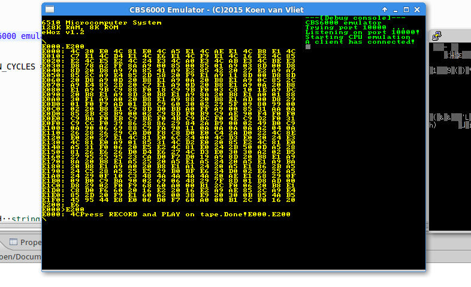

## About the CBS6000
The CBS6000 is an 6510-based system with lots of interface options including: ADC, UART, FSK modem, Line Printer, Seven segment display. The system contains 128KB of ram as well as an 8kb eeprom which holds the firmware. 
Read more about the computer here 

- A hardware description and software for the computer can be found here: https://github.com/keoni29/cbs6000
- I post updates on the project on my hackaday page: https://hackaday.io/project/4406-cbs6000-computer

## CBS6000 Emulator
Emulators are great for automated testing and debugging. Therefore I decided to write a CBS6000 computer emulator. I based mine off the 6502 emulator written by [Gianluca Ghettini] https://github.com/gianlucag/mos6502. It is really quite simple to interface with the CPU emulator. It uses two callback functions for reading and writing in memory. In those functions I put my address decoder code.

## Features
- Terminal emulator
- Variable execution speed
- Single stepping
- Memory view
- Disassembly view
- Loading/saving memory via TCP socket

## Unimplemented features 
- CIA chips for IO and timers
- Printer port
- Bankswitching
- Interrupts
- Seven segment display
